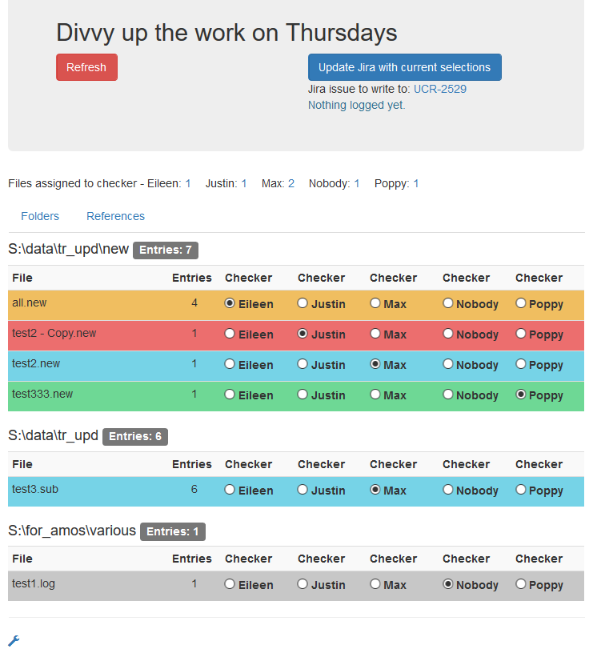

## Divvy
### A tool for quality assurance

Files about to undergo QA are gathered and dislpayed in a table.
A few numbers are collected, PubMed IDs are extracted.
Files can be assigned to people doing QA and this can be looged in a JIRA issue if one is available.
There is also an panel for administrating the underlying SQLite database.

Screenshot of the running tool:

